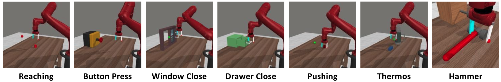

# Sparse Meta-World

This is a set of visual sparse-reward metaworld environments used in our ICML 2021 paper, [LatCo](https://github.com/zchuning/latco). We support the following 7 environments. 



This code is modified from the original MetaWorld for better non-exploitable sparse rewards and easier installation. Please refer to the [LatCo](https://github.com/zchuning/latco) paper for more details and below for installation and usage instructions. 


## Installation and Usage
Sparse Meta-World is based on MuJoCo, which has a proprietary dependency we can't set up for you. Please follow the [instructions](https://github.com/openai/mujoco-py#install-mujoco) in the mujoco-py package for help. Once you're ready to install everything, run:

```
pip install git+https://github.com/zchuning/metaworld.git@master#egg=metaworld
```

Alternatively, you can clone the repository and install an editable version locally:

```
git clone https://github.com/zchuning/metaworld.git
cd metaworld
pip install -e .
```

Now you can simply import the environment from python:

```
from metaworld import SparseMetaWorld
import numpy as np
env = SparseMetaWorld('SawyerReachEnvV2', 2)
o = env.reset()
o,r,d,i = env.step(np.zeros(4))
```

The environment does not return a dense reward, only the 0/1 sparse reward.

By default, the rendering will use glfw. With egl rendering, gpu 0 will be used by default. You can change these with the following environment variables
```
export MUJOCO_RENDERER='egl'
export GL_DEVICE_ID=1
``` 

## Bibtex
If you use the Sparse MetaWorld benchmark for academic research, please kindly cite 
```
@inproceedings{rybkin2021latco,
  title={Model-Based Reinforcement Learning via Latent-Space Collocation},
  author={Rybkin, Oleh and Zhu, Chuning and Nagabandi, Anusha and Daniilidis, Kostas and Mordatch, Igor and Levine, Sergey},
  journal={Proceedings of the 38th International Conference on Machine Learning},
  year={2021}
}
```

```
@inproceedings{yu2019meta,
  title={Meta-World: A Benchmark and Evaluation for Multi-Task and Meta Reinforcement Learning},
  author={Tianhe Yu and Deirdre Quillen and Zhanpeng He and Ryan Julian and Karol Hausman and Chelsea Finn and Sergey Levine},
  booktitle={Conference on Robot Learning (CoRL)},
  year={2019}
  eprint={1910.10897},
  archivePrefix={arXiv},
  primaryClass={cs.LG}
  url={https://arxiv.org/abs/1910.10897}
}
```

## Acknowledgements
The original MetaWorld repo is at https://github.com/rlworkgroup/metaworld. 